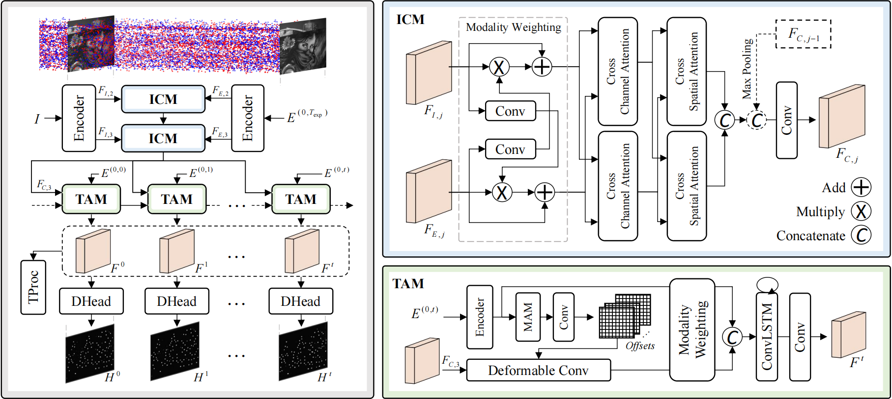

# [Towards Robust Keypoint Detection and Tracking: A Fusion Approach with Event-Aligned Image Features](https://github.com/yuyangpoi/FF-KDT)

# Abstract
Robust keypoint detection and tracking are crucial for various robotic tasks. However, conventional cameras struggle under rapid motion and lighting changes, hindering local and edge feature extraction essential for keypoint detection and tracking. Event cameras offer advantages in such scenarios due to their high dynamic range and low latency. Yet, their inherent noise and motion dependence can lead to feature instability. This paper presents a novel image-event fusion approach for robust keypoint detection and tracking under challenging conditions. We leverage the complementary strengths of image and event data by introducing: (i) the Implicit Compensation Module and Temporal Alignment Module for high-frequency feature fusion and keypoint detection; and (ii) a temporal neighborhood matching strategy for robust keypoint tracking within a sliding window. Furthermore, a self-supervised temporal response consistency constraint ensures keypoint continuity and stability. Extensive experiments demonstrate the effectiveness of our method against state-of-the-art approaches under diverse challenging scenarios. Notably, our method exhibits the longest tracking lifetime and strong generalization ability on real-world data.  

# Network Architecture

# References
[1] C. Philippe, P. Etienne, S. Amos, and L. Vincent, “Long-lived accurate keypoints in event streams,” arXiv preprint arXiv: 2209.10385, 2022.

[2] N. Messikommer, C. Fang, M. Gehrig, and D. Scaramuzza, “Data-driven feature tracking for event cameras,” in Proceedings of the IEEE/CVF Conference on Computer Vision and Pattern Recognition, 2023, pp. 5642–5651.

[3] A. W. Harley, Z. Fang, and K. Fragkiadaki, “Particle video revisited: Tracking through occlusions using point trajectories,” in European Conference on Computer Vision, 2022, pp. 59–75.

